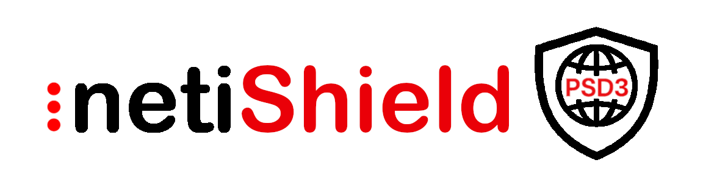
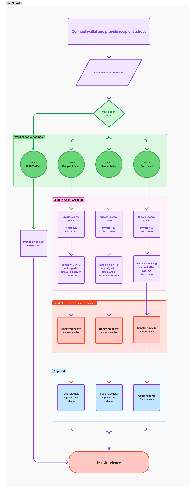

# RLUSD Escrow Verification Framework



<div align="center">

## 📋 QUICK NAVIGATION

[🌐 Live Test Instance](#accessing-the-live-test-instance)  
[📝 Overview](#overview)  
[📱 Usage](#using-the-application)  
[🔧 Setup](#local-setup)  

</div>

---

## Accessing the Live Test Instance

To test the application, you can use the following resources:

- **Application URL**: [https://neti-shield.test.neti-soft.co/](https://neti-shield.test.neti-soft.co/)
- **Escrow Authority Wallet Secret for Xaman**: `sEdVDoJTPFxZGcMwquMs4JhRc54LWVP`

Follow these steps to set up for testing:
1. Create 2 Accounts in Xaman wallet for Sender and Recipient
2. Import the Escrow Authority secret into your Xaman wallet
3. Access the application through the provided URL
4. Use the testing verification providers to simulate different scenarios


## Overview

RLUSD Escrow Verification Framework on the XRP Ledger

This project implements a secure and automated escrow system for RLUSD transactions on the XRP Ledger. It introduces a trust-minimized, provider-agnostic verification flow designed to protect against fraud while enabling streamlined, automated fund transfers.

The sender initiates the transaction by specifying the recipient's address. The system then performs silent identity and risk verification of both parties through three independent external verification providers. These providers—such as Blowfish or others—can be freely selected or swapped out based on specific risk models, jurisdictions, or compliance requirements. If all providers return a positive result, the RLUSD is sent peer-to-peer directly between users.

If either party fails verification, the transaction is rerouted through a secure, self-destructing escrow wallet with multisig controls involving the sender, recipient, and/or an Escrow Authority. This mechanism ensures robust protection even in flagged transactions, enabling dispute resolution while preserving automation and decentralization.

The system is built for high-integrity financial interactions, ensuring safety in automated processes and offering flexible integration with a wide range of verification service providers.

### Verification Flow Diagram



## Using the Application

### Connecting Your Wallet

1. Open the netiShield webapp in your browser
2. Click "Connect" on the interface
3. Open the Xaman app on your mobile device
4. Scan the QR code using your Xaman app
5. Authorize the connection request

### Making Transactions

1. **Initiate a Transfer**: Enter the recipient's address and the amount
2. **Select Verification Providers**: Choose 3 verification providers from the available options
   > **Note for testing:** Each provider has predefined behavior:
   > - Chainalysis: Always fails the sender
   > - Blowfish: Always fails the recipient
   > - Elliptic: Always succeeds for both parties
3. **Confirm**: Review the details and confirm the transaction
4. **Authorization**: Approve the transaction in your Xaman wallet
5. **Track Status**: If verification fails and an escrow is created, monitor the escrow status in real-time on the dashboard (successful peer-to-peer transfers complete immediately and don't require tracking)

### Handling Verification Failures

If a verification check fails, the system will automatically:
1. Create a secure escrow wallet
2. Move funds to this escrow
3. Notify all parties involved
4. Provide dispute resolution options through the interface

### Admin Approval Process

When transactions require approval due to verification failures:
1. Log in to the admin interface using your administrator credentials
2. Navigate to the "Pending Approvals" section
3. Review the transaction details and verification results
4. Approve or reject the transaction based on your assessment
5. For approved transactions, funds will be released from escrow to the recipient

## Local setup

### Prerequisites

- Xaman wallet (formerly XUMM) installed on your mobile device
  - XUMM Developer API credentials (API Key and API Secret) for integration
  - Verified wallet with wallet activation on mobile device
- Node.js (v18+) for local setup

### Quick Setup

1. Clone the repository
2. Install dependencies for both frontend and backend:
   ```
   cd backend && npm install
   cd ../frontend && npm install
   ```
3. Start the application:
   ```
   # In backend directory
   #create .env from example
   cp .env.example .env
   #run docker compose configuration (Postgres database service)
   docker compose up -d
   #start backend application
   npm run start:dev
   
   # In frontend directory
   #start frontend application
   npm start
   ```
